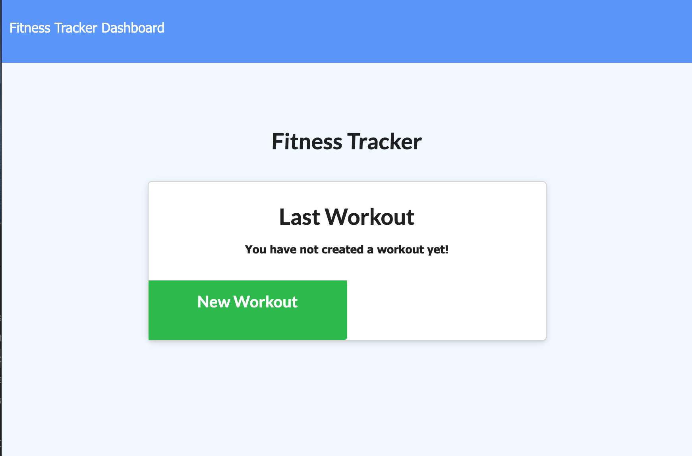
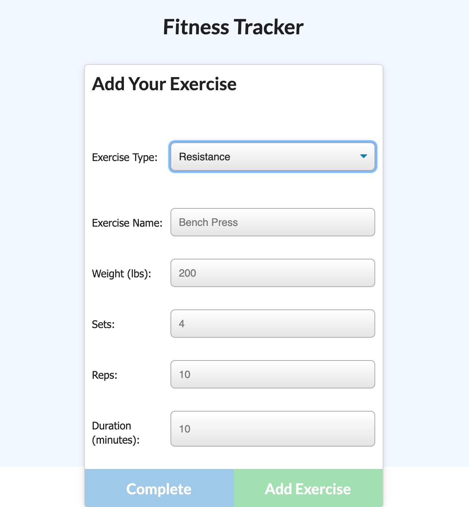

# workout-app
App for logging workouts

## Description

This app allows a user to log several workouts, tracking excercises, weight, sets/reps, duration, and distance, as appropriate by excercise type.

The user can decide between creating a new workout or resuming thier old work out.

My contribution to this project was the backend, powered by a mongoDB.

## App operation

Please be sure to install all npm dependencies by running an "npm install" command. 

Upon launching the app, the user will be presented with the following interface:

The user is then allowed to fill in a form, populated by excercise type, to collect all relevant information regarding the exercise. The user can add as many exercises as desired to build out their workout. 

## Links

Please see the following example of the launched application: 

![Demo Deployed App] (https://mighty-lowlands-89111.herokuapp.com)